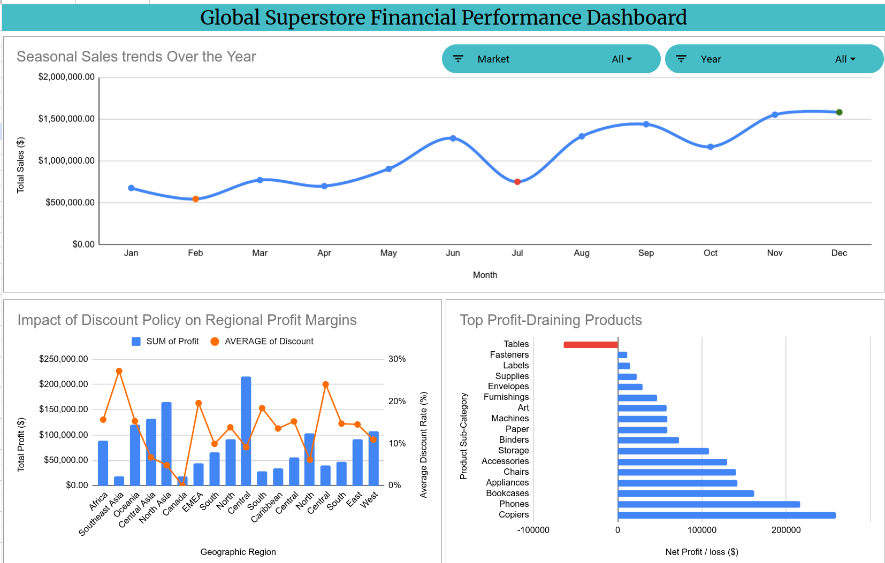

## 🌍 Project Overview: The Ask
Global SuperStore was celebrating massive revenue milestones, yet executive leadership faced a glaring anomaly: profits were inexplicably shrinking. The primary objective of this project was to conduct an in-depth analysis of the global dataset to uncover the underlying causes of profit erosion across product categories.

### 🧹 Data Cleaning & Preparation
To find the ground truth, I isolated raw transactional data to pinpoint exact financial performance metrics. I processed and analyzed over 50,000 sales records, stripping away irrelevant columns and standardizing financial formats to ensure complete data integrity and analytical accuracy before building the baseline.

---

## 📊 Dashboard & Key Discoveries

By examining the financial performance dashboard and data models, three critical failure points in the business model became instantly visible:

*   **Volume Does Not Equal Value (The Table Crisis):** The **Tables** category generates a massive **$757,000** in sales volume, but it results in a severe net loss of **-$64,000**. It represents the only highly negative product sub-category in the portfolio, showing that sheer volume was masking pricing and logistical failures.
*   **The Discount Trap:** Retail discount policies act as the silent killer of regional profit margins when left unchecked. For instance, Southeast Asia suffered collapsing profits due to an aggressive **27%** average discount rate, while Central Asia maintained excellent profitability with a disciplined **7%** discount rate.
*   **The Market Rhythm (Seasonal Trends):** Sales peak dramatically in Q4 (November and December) while suffering a severe slump in mid-year (July). This indicated that capital was being tied up in stagnant mid-year dead stock rather than maximizing the Q4 peak.

---

## 🚀 Strategic Recommendations & Resolution

Data is only as valuable as the decisions it drives. Based on the evidence uncovered, I proposed a three-pillar strategy to immediately stop the profit erosion:

1.  **Pricing & Logistics:** Renegotiate international shipping contracts for heavy items like tables, or adjust their pricing model to absorb the shipping costs.
2.  **Discount Cap:** Implement a strict discount cap of **10% - 15%** in underperforming global regions to instantly recover lost margins.
3.  **Inventory Strategy:** Drastically reduce procurement orders before the July slump, redirecting capital to ramp up inventory scaling in late summer to prepare for the Q4 peak.

> *High sales volume must be paired with strategic pricing and disciplined discounting to ensure true profitability.*

🔗 **Project Repository:** [View Full Source Code and Data on GitHub](Https://github.com/TariqZJawad/global-superstore-financial-analysis)
