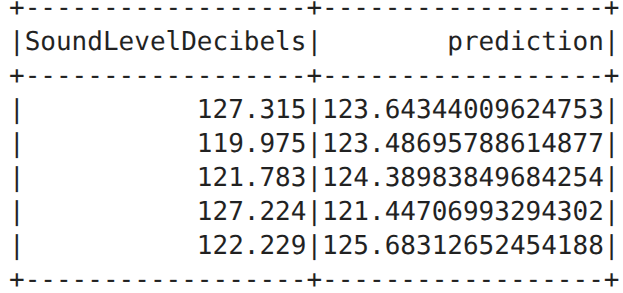

## 🔍 Project Overview: The Aerodynamic Noise Challenge
In modern aeronautics and high-performance automotive engineering, **aerodynamic noise** is a critical design constraint. As air flows over an airfoil—like an aircraft wing or a turbine blade—turbulence interacts with the trailing edge, generating self-noise. 

Testing every new wing prototype inside an acoustic wind tunnel is **expensive, time-consuming, and resource-intensive**. 

**The Solution:** This project builds a scalable Machine Learning Pipeline using Apache Spark (PySpark). By leveraging historical wind tunnel data from **NASA**, the pipeline processes raw aerodynamic measurements and trains a predictive model to estimate the **Sound Pressure Level (in Decibels)** of an airfoil before it is ever physically manufactured.

## ⚙️ Architecture & ETL Workflow
To ensure the solution can scale from thousands to millions of sensor readings in a distributed environment, the entire workflow is engineered using **PySpark SQL** and **PySpark MLlib**.

*   **Extraction:** Ingested 1,522 rows of raw telemetry data (CSV) detailing frequency, angle of attack, chord length, free-stream velocity, and boundary layer thickness.
*   **Transformation (Spark ETL):** Executed strict data quality checks, deduplication (`dropDuplicates`), and null removal (`dropna`), resulting in 1,499 clean records. The optimized dataset was saved as **Apache Parquet** for columnar storage and faster I/O performance.
*   **Feature Engineering:** Built a robust Spark ML Pipeline using `VectorAssembler` to consolidate input features, and `StandardScaler` to normalize parameters with drastically varying scales (e.g., frequencies in thousands of Hz vs. displacements in thousandths of a meter).

---

## 📊 Investigative Data Story & Key Findings
The preprocessed data was split (70/30) to train a multivariate `LinearRegression` model. The resulting model successfully maps physical constraints to acoustic outputs, revealing the core drivers of airfoil noise.

### 1. High Accuracy on Unseen Data
The model achieved a **Mean Absolute Error (MAE) of 3.73 dB**, meaning its predictions deviate by less than 4 decibels from actual physical wind tunnel measurements. The linear baseline explains **54%** ($R^2 = 0.54$) of the variance in acoustic noise across diverse aerodynamic regimes.

### 2. The Primary Noise Drivers
By inspecting the learned weights of the standardized model, we extracted physical engineering insights:
*   **Velocity Increases Noise:** `FreeStreamVelocity` (+1.5789) is the primary positive driver. Faster airflow directly increases kinetic energy and turbulence intensity, raising noise levels.
*   **Frequency Damping:** `Frequency` (-3.9728) is the strongest inverse driver. Higher acoustic frequencies damp out faster, exhibiting lower sound pressure levels.
*   **Size and Geometry:** Larger `ChordLength` (-3.3818) shifts the acoustic spectrum, effectively reducing high-frequency trailing-edge noise.

---

## 🚧 Roadblocks & Data Caveats
*   **Linear Limitations:** While the linear regression model established a strong baseline, fluid dynamics and turbulence are highly non-linear phenomena. The current model might under-predict extreme turbulent anomalies.
*   **Dataset Scale:** The NASA dataset (1,499 rows post-ETL) is relatively small for Big Data tools. However, using PySpark ensures that this exact architecture can instantly scale to process terabytes of real-time sensor data from physical wind tunnels without any code changes.

## 💡 Strategic Recommendations
1.  **Algorithmic Upgrade:** Upgrade the ML Pipeline's final stage from Linear Regression to a distributed non-linear model (like `RandomForestRegressor` or `GBTRegressor` in PySpark) to capture complex aerodynamic interactions and boost the $R^2$ score.
2.  **Real-Time Streaming:** Integrate Apache Kafka with Spark Structured Streaming to predict airfoil noise in real-time as physical sensors stream data from the wind tunnel.
3.  **API Deployment:** Serialize the `PipelineModel` into a REST API (using FastAPI or Flask) to allow mechanical engineers to input design parameters and instantly receive Decibel predictions during the CAD prototyping phase.

🔗 **Project Repository:** [View Full Source Code on GitHub](https://github.com/TariqZJawad/-nasa-airfoil-noise-prediction-pyspark.git)
