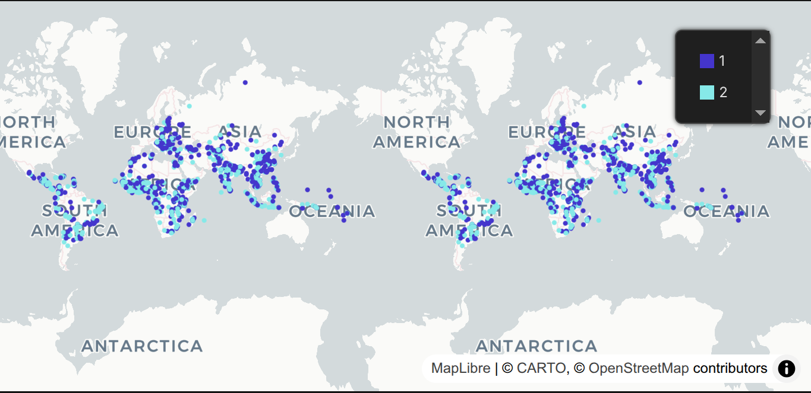

## 🔍 Project Overview: The $6 Billion Question
Every year, billions are pledged to global development and relief, but do these funds actually reach their intended destinations? This project exposes a staggering deficit between massive financial commitments (over $6.22 Billion) and actual disbursements (only $1.23 Million). The core issues lie in a lack of transparency, funds evaporating into astronomical administrative overheads, and active manipulation through project fragmentation to evade audits.

## ⚙️ Architecture & ETL Workflow
The project revolves around a robust data pipeline integrating ProPublica, World Bank, and AidData sources to uncover the truth.

*   **Extraction:** Fetched organizational financial filings and macroeconomic indicators via APIs, alongside massive geospatial CSVs.
*   **Transformation (PostgreSQL):** Data cleaning, type casting, and array conversions were handled entirely within PostgreSQL using the `DIIP.sql` script.
*   **Risk Scoring Engine:** Executed a Min-Max Normalization algorithm in SQL to calculate risk scores based on financial gaps, smurfing, geographic dispersion, and sectoral fragmentation.

---

## 📊 Investigative Data Story & Key Findings
The analysis transitioned to Apache Superset to build an interactive dashboard that visualizes the global donation deficit.

### 1. Massive Pledges, Minimal Execution
We tracked $6.22 Billion in commitments against a mere $1.23 Million in actual disbursements, highlighting a severe bottleneck before funds reach recipient countries.

### 2. Is the Money Following the Need?
Funding is often randomly distributed, ignoring the actual GDP per capita of recipient nations, indicating allocation is driven by factors other than pure economic need.

### 3. The Intermediary Absorption
Organizations operating with astronomical administrative overhead ratios are absorbing millions into operational costs rather than executing promised projects.

### 4. Active Manipulation Tactics
The system is actively gamed, with 61.34% of suspicious projects using "Fragmentation" (splitting funds across confusing categories) and 36.93% using "Smurfing" (breaking large funds into micro-transactions).

Vague, repetitive terms like "project" and "develop" dominate project titles, obscuring specific, trackable deliverables.

### 5. Spatial Reality of Risk
High-risk transactions cluster in specific global pockets, proving that risk is a systemic pattern concentrated in regions with compromised financial oversight.

---

## 🚧 Roadblocks & Data Caveats
*   Encountered cloud hosting constraints with Superset via Docker, shifting to a robust, Code-First Reproducible approach.
*   Engineered a robust retry mechanism in Python to mitigate unstable responses from the World Bank API.
*   **Aggregation Caveat:** The `$6.22B vs $1.23M` figure uses `DISTINCT` aggregations, which may silently drop legitimate duplicate rows and understate true totals.
*   **Geospatial Caveat:** Joining transactions on `project_id` alone can inflate geographic dispersion scores for projects with multiple locations.

## 💡 Strategic Recommendations
1.  **Cap Administrative Overhead:** Enforce a strict maximum overhead ratio for all civil society partners.
2.  **Milestone-Based Disbursements:** Shift from bulk commitments to micro-releases tied strictly to verified, geolocated milestones.
3.  **Algorithmic Auditing:** Deploy this exact risk-scoring engine to flag anomalies like 'Smurfing' before funds are approved.

🔗 **Project Repository:** [View Full Source Code on GitHub](https://github.com/TariqZJawad/-Donation-Integrity-Investigation-Program-DIIP-)
