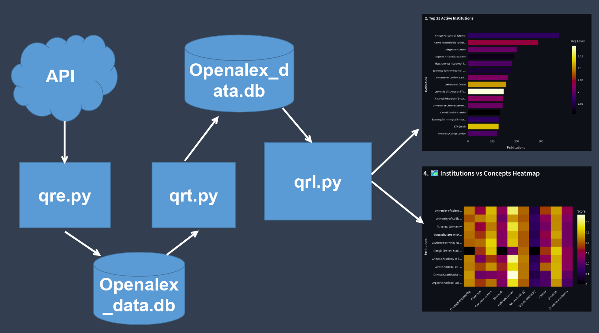
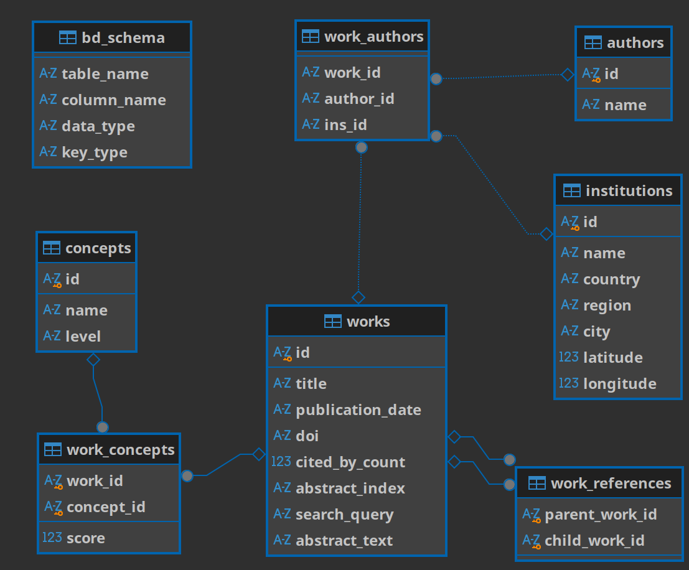
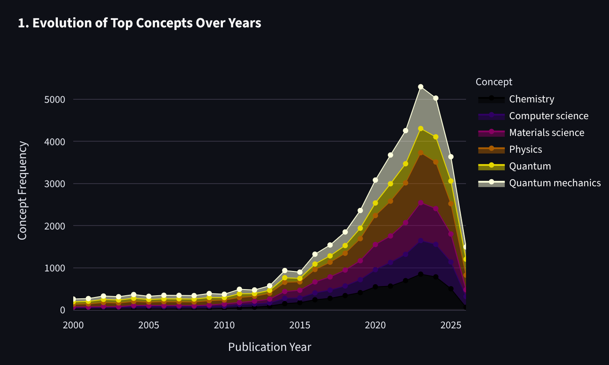
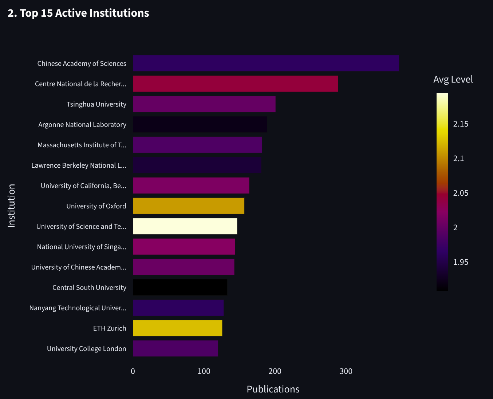
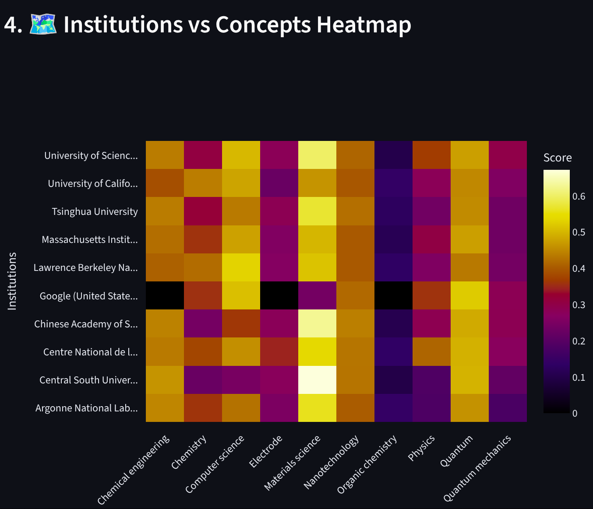
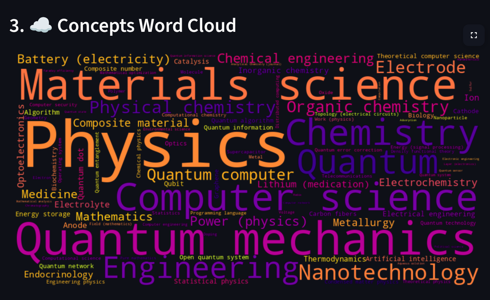

## 📖 Storytelling & Origin

As a theoretical and computational physics graduate aiming for advanced studies in quantum computing and quantum battery dynamics, I needed more than just reading papers; I needed a strategic understanding of global scientific trends. I built this OpenAlex API Research Pipeline to track how specific quantum concepts evolve, identify leading global institutions, and evaluate potential academic destinations. This project also serves as my capstone for the Python for Everybody Specialization.

---

## 🏗️ Architecture (ETL Pipeline)

This project follows a strict Extract, Transform, Load (ETL) architecture to ensure data integrity and performance. The pipeline is divided into three dedicated Python scripts to separate concerns and maximize efficiency:

1. **Extraction (`qre.py`):** Pulls raw JSON data from the OpenAlex API with pagination, rate-limit management, and fault-tolerant scraping.
2. **Transformation & Cleaning (`qrt.py`):** Scrubs the raw database, normalizes dates, removes orphans, and reconstructs fragmented OpenAlex inverted-index abstracts into fully readable text blocks.
3. **Loading & Visualization (`qrl.py`):** Connects to the optimized SQLite database and dynamically renders the analytical dashboard using Streamlit and Pandas without re-querying the API.

### 🗄️ Database Schema
The backend relies on complex relational mapping to handle many-to-many relationships across 7 specialized tables.

---

## 📊 Data Visualizations & Analytics

The interactive dashboard (powered by Plotly) translates raw data into strategic insights for researchers.

### 1. Evolution of Concepts (Area Chart)
Visualizing the volume of specific concepts over time highlights the "momentum" of a research topic. This helps identify whether a niche like "Quantum Batteries" is an emerging trend, peaking, or plateauing.

### 2. Top Active Institutions (Horizontal Bar Chart)
By mapping publication volume against the average "Concept Level," this chart reveals who publishes fundamental (low-level) versus applied (high-level) research—a critical metric for shortlisting universities for graduate studies.

### 3. Precision Targeting (Heatmap & Word Cloud)
The matrix cross-references research hubs with specific scientific concepts (e.g., answering "Which institution should I target for Quantum Error Correction?"), while the word cloud provides an immediate snapshot of dominant themes.

---

## 🌱 The Foundational Knowledge Tree

A custom algorithm designed for efficient literature reviews. By searching for a core concept, it fetches relevant papers sorted from the lowest level (most fundamental physics) and oldest publication date. It allows a researcher to trace the historical roots of an idea, read how it was initially defined, and follow its progression up to modern applications.

> *"This project is a functional prototype for a much larger vision: building an educational platform structured entirely around the historical frequency and hierarchical level of scientific knowledge."*

🔗 **Project Repository:** [View Source Code on GitHub](Https://github.com/TariqZJawad/OpenAlex-Quantum-API-Research-Pipeline-Project/tree/main)
🌐 **Live Application:** [Explore the Quantum Research Dashboard](https://openalex-quantum-api-research-pipeline-project.streamlit.app/)
